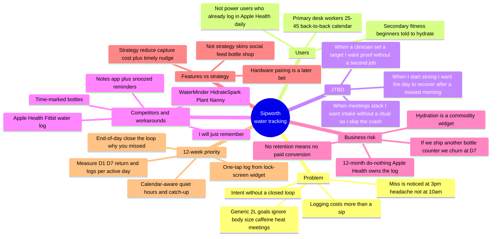

# Strategic Discovery Map

> **Module 1 · Lab 1.** Repo file `01-product-thinking/strategic-map.md` — part of your submission.
> Do the lab in the **Module 1 · Exercise 1 Guide** (linked from the Module 1 deck), then click **⬇ Download .md** — it saves as this exact file. Commit it here.
> It's the discovery groundwork behind your `problem-hook.md`.

## Product (own initiative)

Water tracking app. Working name for the lab: **Sipworth**. Not StreamLine Spotlight and not RouteLogic Velocity.

**One-line bet:** Busy desk workers already know they should drink more water; they fail because logging and reminding are the wrong shape for a workday, so they abandon generic hydration apps in a week.

## Strategic discovery map (V3)

### Map notes (used to judge features)

| Branch | What we believe | Implication for 12 weeks |
|---|---|---|
| Problem | The failure is **capture + timing**, not lack of education. | Do not spend the sprint on content, tips, or “hydration science.” |
| Users | Primary is the **calendar-constrained desk worker**, not the quantified-self power user. | Optimize for 5-second logging in a meeting gap, not for charts. |
| JTBD | Job is **hit today’s target without a ritual**, and still recover if morning was empty. | Catch-up and quiet hours matter more than a perfect 2L default. |
| Competitors / workarounds | People already have bottles, notes, and snoozed reminders. Those fail at the same moment. | Differentiation is closing the loop at the miss, not another reminder type. |
| Business risk | Commodity logging is owned by Health apps; we die on **week-1 retention**. | Every V1 feature must change D1/D7 or logs-per-active-day, or it waits. |
| Features vs strategy | Strategy = cheaper capture + contextual nudge + daily review. | Skins, social, and Bluetooth are adjacent, not the bet. |

## Responses

- **Feature with no strategic answer (why is this a 12-week priority?):** Bluetooth / smart-bottle pairing. It showed up on the Step 1 map because “hydration apps have bottles,” but it has no answer for this 12-week window. We have not proven that the miss is *input hardware* versus *memory and friction on a phone they already have*. Pairing lengthens the build, adds SKU and support, and still leaves the 3pm-headache moment unsolved if they forget the bottle. It is a later bet, after one-tap log + calendar-aware catch-up either works or fails.
- **Feature that looks "correct" but has zero strategic weight:** Streak freezes, bottle skins, and a social hydration feed. They look like a finished consumer app and they copy what WaterMinder/Plant Nanny already ship. They do not change the moment of misery (logging costs more than a sip; reminders get snoozed in meetings). Until D7 return moves, cosmetics and social are decoration on a habit that did not form.
- **V3 vs your Step 1 baseline — what changed, and was it your PM knowledge that forced usefulness?:** Step 1 was a generic “hydration app”: daily goal, reminders, streaks, bottle pairing, pretty charts. Useful as a feature dump, not as a strategy. V3 cut the persona to desk workers with stacked calendars, named the job (intake without a ritual), listed the real workarounds (marked bottle, Notes, snooze, “I’ll remember”), and tied the business risk to D7 churn versus Apple Health. PM judgment — not more features — forced that: a 12-week priority is the smallest loop that tests capture cost and timing (widget log, quiet hours, end-of-day why-you-missed). Everything else dropped because it had no theory of retention.
